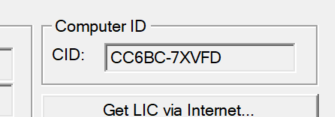

# 0-0 STM32CubeMX和Keil MDK5安装、配置

> 本节我们将介绍STM32开发的常用软件，以及CubeMX和Keil MDK5的安装和配置。
>
> 仿真器驱动在文件夹中，可以直接下载使用。由于文件大小限制，软件安装包需要在QQ群或其他来源下载。\
> assets文件夹中是该文档的图片资源文件，没有离线阅读需求可以忽略。
>
> 此repo仅用于DHU NUEDC实验室校内培训用途。\
> 需要答疑或有兴趣深入学习，欢迎至信息学院2202实验室交流。

## 1. 常用STM32开发环境

### 1.1 常用IDE

- Keil MDK: "MDK" = Microcontroller Development Kit, 微控制器开发套件, 由ARM公司提供的开发工具
- IAR Embedded Workbench: IAR嵌入式工作台, 由IAR公司提供的开发工具
- STM32CubeIDE: 由ST公司提供的开发工具
- 其他第三方代码编辑器: Visual Studio, VSCode等, 其中VSCode有ST官方的拓展插件

其中Keil集成程度高，功能丰富，较为稳定；而VSCode更加轻量, 完全免费，在代码辅助等方面更加智能，在此介绍Keil MDK5和VSCode开发环境的安装和配置。

### 1.2 辅助软件

- STM32CubeMX: 由ST公司近几年推出并大力推荐的配置工具，可以配置STM32的时钟、外设、中断等，生成代码框架。可以极大简化我们的工作。
- STM32CubeProgrammer: 由ST公司推出的烧录工具，可以烧录代码到STM32芯片中，也可以擦除芯片中的代码。Keil已经可以完成这项工作，因此我们不需要安装这个软件。
- STM32CubeMonitor: 由ST公司推出的监控工具，可以监控STM32芯片的运行状态，可以监控芯片的时钟、外设、中断等，可以监控芯片的电压、温度等。暂时不安装这个软件。

### 1.3 常用的STM32仿真器

- ST-Link: 由ST公司推出的仿真器。稳定性较好，但价格相对高一些，实验室并没有公用的ST-Link，一般需要自行购买。
- DAP-Link: ARM公司推出的开源仿真器。稳定性一般，常见于板载调试器。
- J-Link: SEGGER公司推出的仿真器，稳定性一般，但价格较低。我们可以提供一些J-Link给大家使用。

```注意使用仿真器是否需要安装驱动程序。J-Link和ST-Link驱动程序在文件夹中，可直接下载使用。```

> 注意: Keil和VSCode的安装可以任选其一

## 2.1. 安装Keil MDK5

*我们坚定支持使用正版软件(确信)*\
所以**QQ群**之类的地方*一定没有*破解软件的安装包。\
在此仅介绍Keil的安装和破解方式，不提供安装包。

1. 运行mdk528a.exe
2. 接受EULA
3. 选择core和pack的安装路径
4. 输入个人信息。并不影响操作，可以随意填写。
5. 等待安装完毕。
6. 打开Keil，打开左上角的File->License Management，复制CID。
   
7. 关掉电脑音频。不然会后悔的。
8. 打开keygen_new2032.exe，运行破解程序。
9. 粘贴CID，其他选项不需要更改，点击Generate，将生成的License复制到License Management下方的LIC输入框中，点击Add LIC，破解完成。

## 2.2. 安装和配置VSCode

1. 下载并安装VSCode: <https://code.visualstudio.com/>
2. 安装stm32 VS Code Extension的依赖项:
   - STM32CubeMX
   - STM32CubeIDE ```注意(适用于stm32拓展v1.0.0): 安装时务必选择默认安装路径, 否则插件无法识别```
   - STMCUFinder ```注意(适用于stm32拓展v1.0.0): 安装时务必选择默认安装路径, 否则插件无法识别```
   - 安装Git: <https://git-scm.com/downloads>
3. 安装完成后, 在左侧找到拓展商店, 安装我们会用到的以下插件:
   - C/C++
   - C/C++ Extension Pack
   - CMake
   - CMake Tools
   - Cortex-Debug
   - Arm Virtual Hardware
   - Embedded Tools
   - stm32 VS Code Extension
   另外推荐的插件:
   - Error Lens (更直观的错误提示)
   - GitHub Copilot (AI代码感知和生成, 通过GitHub学生认证可以在在校期间免费使用)
     或: TabNine (同样支持AI代码感知, 可免费使用, 但能力有限)
   - Serial Monitor (内置串口监视器)
4. 在代码可以烧录之前, 我们需要更新ST-Link的固件版本:
   - 下载并安装STSW-LINK007: <https://www.st.com/en/development-tools/stsw-link007.html>
   - 运行STSW-LINK007, 检测ST-Link设备, 点击Upgrade, 等待固件更新完成
5. (仅限v1.0.0版本) 更改编译器路径: 在项目文件夹中找到launch.json, 将其中"miDebuggerPath"至"debugServerArgs"替换成自己的路径:

   ```json
      "miDebuggerPath": "C:/ST/STM32CubeIDE_1.12.1/STM32CubeIDE/plugins/com.st.stm32cube.ide.mcu.externaltools.gnu-tools-for-stm32.10.3-2021.10.win32_1.0.200.202301161003/tools/bin/arm-none-eabi-gdb.exe",
      "miDebuggerServerAddress": "localhost:3333",
      "debugServerPath": "C:/ST/STM32CubeIDE_1.12.1/STM32CubeIDE/plugins/com.st.stm32cube.ide.mcu.externaltools.stlink-gdb-server.win32_2.0.500.202301161003/tools/bin/ST-LINK_gdbserver.exe",
      "debugServerArgs": "--stm32cubeprogrammer-path C:/ST/STM32CubeIDE_1.12.1/STM32CubeIDE/plugins/com.st.stm32cube.ide.mcu.externaltools.cubeprogrammer.win32_2.0.600.202301161003/tools/bin --swd --port-number 3333",
   ```

## 3. 安装STM32CubeMX

可直接按照安装向导提示安装。STM32Cube系列均为免费，无需破解等操作。

---

> Author: Clive
>
> Updated: 2023/7/7

## 4. 安装STM32CubeMX
## 5. 测试
## 6. 测试
